# Star Tracker Report

**2026-09-07** | Total: **611 stars** | Change: **+44**

> Compared to snapshot from 2026-08-08

## 📈 Star Trend

### By Repository

Individual Repository Charts

#### isontheline/pro.webssh.net: 611 ★ (+44)

## Repositories

| Repositories | Stars | Change | Trend |
|:-----------|------:|-------:|:-----:|
| [isontheline/pro.webssh.net](https://github.com/isontheline/pro.webssh.net) | 611 | +44 | ⬆️ |

## Summary

- **Stars gained:** 44
- **Stars lost:** 0
- **Net change:** +44

## 🔮 Growth Forecast

**Aggregate Forecast**

| Method | Week 1 | Week 2 | Week 3 | Week 4 |
|:---|---:|---:|---:|---:|
| Linear Regression | 613 | 614 | 616 | 618 |
| Weighted Moving Average | 614 | 616 | 619 | 621 |

### By Repository

isontheline/pro.webssh.net

**isontheline/pro.webssh.net**

| Method | Week 1 | Week 2 | Week 3 | Week 4 |
|:---|---:|---:|---:|---:|
| Linear Regression | 613 | 614 | 616 | 618 |
| Weighted Moving Average | 614 | 616 | 619 | 621 |

---
*Generated by [GitHub Star Tracker](https://github.com/fbuireu/github-star-tracker) on 2026-09-07T03:38:57.510Z*

*Made with 🤘 by [Ferran Buireu](https://github.com/fbuireu)*

