# Star Tracker Report

**2026-09-05** | Total: **610 stars** | Change: **+46**

> Compared to snapshot from 2026-08-06

## 📈 Star Trend

### By Repository

Individual Repository Charts

#### isontheline/pro.webssh.net: 610 ★ (+46)

## Repositories

| Repositories | Stars | Change | Trend |
|:-----------|------:|-------:|:-----:|
| [isontheline/pro.webssh.net](https://github.com/isontheline/pro.webssh.net) | 610 | +46 | ⬆️ |

## Summary

- **Stars gained:** 46
- **Stars lost:** 0
- **Net change:** +46

## 🔮 Growth Forecast

**Aggregate Forecast**

| Method | Week 1 | Week 2 | Week 3 | Week 4 |
|:---|---:|---:|---:|---:|
| Linear Regression | 612 | 613 | 615 | 617 |
| Weighted Moving Average | 613 | 615 | 618 | 620 |

### By Repository

isontheline/pro.webssh.net

**isontheline/pro.webssh.net**

| Method | Week 1 | Week 2 | Week 3 | Week 4 |
|:---|---:|---:|---:|---:|
| Linear Regression | 612 | 613 | 615 | 617 |
| Weighted Moving Average | 613 | 615 | 618 | 620 |

---
*Generated by [GitHub Star Tracker](https://github.com/fbuireu/github-star-tracker) on 2026-09-05T03:35:34.522Z*

*Made with 🤘 by [Ferran Buireu](https://github.com/fbuireu)*

