# Star Tracker Report

**2026-08-01** | Total: **620 stars** | Change: **+620**

## 📈 Star Trend

### By Repository

Individual Repository Charts

#### isontheline/pro.webssh.net

#### isontheline/webssh.sh

#### isontheline/vscode-sysmon

#### isontheline/CotEditorScripts

#### isontheline/SSHConfig

#### isontheline/wolfdotsolar

#### isontheline/detectify-client

#### isontheline/ChopChop

#### isontheline/ChopChopAction

#### isontheline/directus-extension-user-role-css-injector

## Repositories

| Repositories | Stars | Change | Trend |
|:-----------|------:|-------:|:-----:|
| [isontheline/pro.webssh.net](https://github.com/isontheline/pro.webssh.net) `NEW` | 560 | 0 | ➖ |
| [isontheline/webssh.sh](https://github.com/isontheline/webssh.sh) `NEW` | 21 | 0 | ➖ |
| [isontheline/vscode-sysmon](https://github.com/isontheline/vscode-sysmon) `NEW` | 10 | 0 | ➖ |
| [isontheline/CotEditorScripts](https://github.com/isontheline/CotEditorScripts) `NEW` | 6 | 0 | ➖ |
| [isontheline/SSHConfig](https://github.com/isontheline/SSHConfig) `NEW` | 6 | 0 | ➖ |
| [isontheline/wolfdotsolar](https://github.com/isontheline/wolfdotsolar) `NEW` | 6 | 0 | ➖ |
| [isontheline/detectify-client](https://github.com/isontheline/detectify-client) `NEW` | 3 | 0 | ➖ |
| [isontheline/ChopChop](https://github.com/isontheline/ChopChop) `NEW` | 2 | 0 | ➖ |
| [isontheline/ChopChopAction](https://github.com/isontheline/ChopChopAction) `NEW` | 2 | 0 | ➖ |
| [isontheline/directus-extension-user-role-css-injector](https://github.com/isontheline/directus-extension-user-role-css-injector) `NEW` | 2 | 0 | ➖ |
| [webssh-software/.github](https://github.com/webssh-software/.github) `NEW` | 2 | 0 | ➖ |
| [isontheline/ALE](https://github.com/isontheline/ALE) `NEW` | 0 | 0 | ➖ |
| [isontheline/AppIconKit](https://github.com/isontheline/AppIconKit) `NEW` | 0 | 0 | ➖ |
| [isontheline/CSSH](https://github.com/isontheline/CSSH) `NEW` | 0 | 0 | ➖ |
| [isontheline/fastlistbuilder](https://github.com/isontheline/fastlistbuilder) `NEW` | 0 | 0 | ➖ |
| [isontheline/gotangle](https://github.com/isontheline/gotangle) `NEW` | 0 | 0 | ➖ |
| [isontheline/mybooklive-meteofrance-vigilance-led](https://github.com/isontheline/mybooklive-meteofrance-vigilance-led) `NEW` | 0 | 0 | ➖ |
| [isontheline/panasonic-html-image-app](https://github.com/isontheline/panasonic-html-image-app) `NEW` | 0 | 0 | ➖ |
| [isontheline/smdr-parser](https://github.com/isontheline/smdr-parser) `NEW` | 0 | 0 | ➖ |

## New Repositories

- [isontheline/ALE](https://github.com/isontheline/ALE): 0 stars
- [isontheline/AppIconKit](https://github.com/isontheline/AppIconKit): 0 stars
- [isontheline/ChopChop](https://github.com/isontheline/ChopChop): 2 stars
- [isontheline/ChopChopAction](https://github.com/isontheline/ChopChopAction): 2 stars
- [isontheline/CotEditorScripts](https://github.com/isontheline/CotEditorScripts): 6 stars
- [isontheline/CSSH](https://github.com/isontheline/CSSH): 0 stars
- [isontheline/detectify-client](https://github.com/isontheline/detectify-client): 3 stars
- [isontheline/directus-extension-user-role-css-injector](https://github.com/isontheline/directus-extension-user-role-css-injector): 2 stars
- [isontheline/fastlistbuilder](https://github.com/isontheline/fastlistbuilder): 0 stars
- [isontheline/gotangle](https://github.com/isontheline/gotangle): 0 stars
- [isontheline/mybooklive-meteofrance-vigilance-led](https://github.com/isontheline/mybooklive-meteofrance-vigilance-led): 0 stars
- [isontheline/panasonic-html-image-app](https://github.com/isontheline/panasonic-html-image-app): 0 stars
- [isontheline/pro.webssh.net](https://github.com/isontheline/pro.webssh.net): 560 stars
- [isontheline/smdr-parser](https://github.com/isontheline/smdr-parser): 0 stars
- [isontheline/SSHConfig](https://github.com/isontheline/SSHConfig): 6 stars
- [isontheline/vscode-sysmon](https://github.com/isontheline/vscode-sysmon): 10 stars
- [isontheline/webssh.sh](https://github.com/isontheline/webssh.sh): 21 stars
- [isontheline/wolfdotsolar](https://github.com/isontheline/wolfdotsolar): 6 stars
- [webssh-software/.github](https://github.com/webssh-software/.github): 2 stars

## Summary

- **Stars gained:** 0
- **Stars lost:** 0
- **Net change:** +620

## 🔮 Growth Forecast

**Aggregate Forecast**

| Method | Week 1 | Week 2 | Week 3 | Week 4 |
|:---|---:|---:|---:|---:|
| Linear Regression | 621 | 623 | 624 | 626 |
| Weighted Moving Average | 622 | 624 | 627 | 629 |

### By Repository

isontheline/pro.webssh.net

**isontheline/pro.webssh.net**

| Method | Week 1 | Week 2 | Week 3 | Week 4 |
|:---|---:|---:|---:|---:|
| Linear Regression | 561 | 563 | 564 | 565 |
| Weighted Moving Average | 562 | 564 | 566 | 568 |

isontheline/webssh.sh

**isontheline/webssh.sh**

| Method | Week 1 | Week 2 | Week 3 | Week 4 |
|:---|---:|---:|---:|---:|
| Linear Regression | 21 | 21 | 21 | 21 |
| Weighted Moving Average | 21 | 21 | 21 | 21 |

isontheline/vscode-sysmon

**isontheline/vscode-sysmon**

| Method | Week 1 | Week 2 | Week 3 | Week 4 |
|:---|---:|---:|---:|---:|
| Linear Regression | 10 | 10 | 10 | 10 |
| Weighted Moving Average | 10 | 10 | 10 | 10 |

isontheline/CotEditorScripts

**isontheline/CotEditorScripts**

| Method | Week 1 | Week 2 | Week 3 | Week 4 |
|:---|---:|---:|---:|---:|
| Linear Regression | 6 | 6 | 6 | 6 |
| Weighted Moving Average | 6 | 6 | 6 | 6 |

isontheline/SSHConfig

**isontheline/SSHConfig**

| Method | Week 1 | Week 2 | Week 3 | Week 4 |
|:---|---:|---:|---:|---:|
| Linear Regression | 6 | 6 | 6 | 6 |
| Weighted Moving Average | 6 | 6 | 6 | 6 |

isontheline/wolfdotsolar

**isontheline/wolfdotsolar**

| Method | Week 1 | Week 2 | Week 3 | Week 4 |
|:---|---:|---:|---:|---:|
| Linear Regression | 6 | 6 | 6 | 6 |
| Weighted Moving Average | 6 | 6 | 6 | 6 |

isontheline/detectify-client

**isontheline/detectify-client**

| Method | Week 1 | Week 2 | Week 3 | Week 4 |
|:---|---:|---:|---:|---:|
| Linear Regression | 3 | 3 | 3 | 3 |
| Weighted Moving Average | 3 | 3 | 3 | 3 |

isontheline/ChopChop

**isontheline/ChopChop**

| Method | Week 1 | Week 2 | Week 3 | Week 4 |
|:---|---:|---:|---:|---:|
| Linear Regression | 2 | 2 | 2 | 2 |
| Weighted Moving Average | 2 | 2 | 2 | 2 |

isontheline/ChopChopAction

**isontheline/ChopChopAction**

| Method | Week 1 | Week 2 | Week 3 | Week 4 |
|:---|---:|---:|---:|---:|
| Linear Regression | 2 | 2 | 2 | 2 |
| Weighted Moving Average | 2 | 2 | 2 | 2 |

isontheline/directus-extension-user-role-css-injector

**isontheline/directus-extension-user-role-css-injector**

| Method | Week 1 | Week 2 | Week 3 | Week 4 |
|:---|---:|---:|---:|---:|
| Linear Regression | 2 | 2 | 2 | 2 |
| Weighted Moving Average | 2 | 2 | 2 | 2 |

---
*Generated by [GitHub Star Tracker](https://github.com/fbuireu/github-star-tracker) on 2026-08-01T13:01:53.841Z*

*Made with 🤘 by [Ferran Buireu](https://github.com/fbuireu)*

