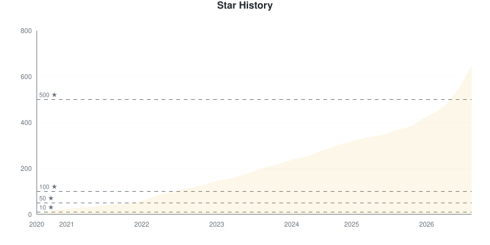
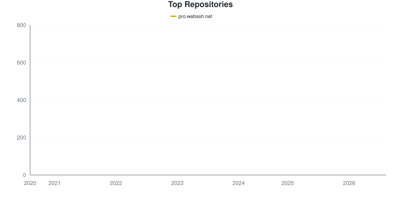
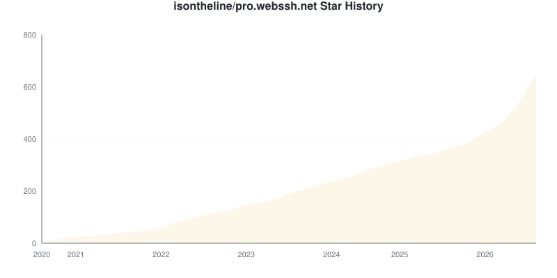
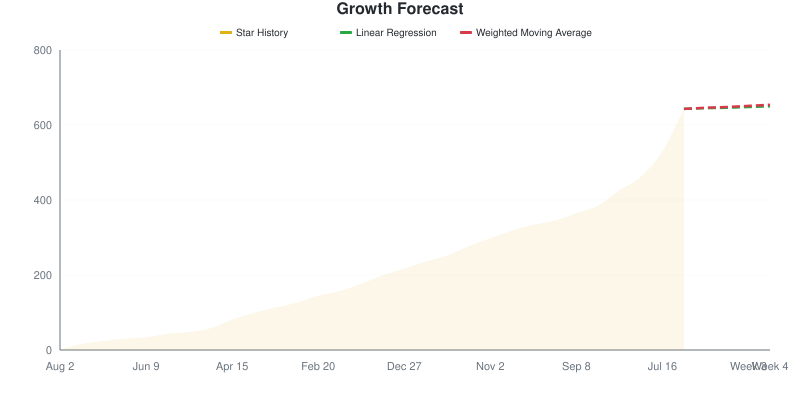
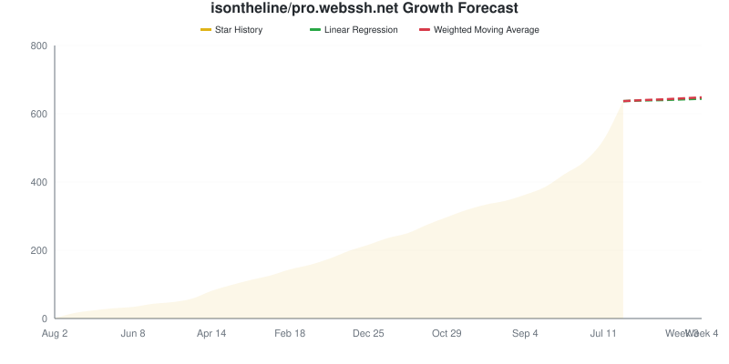

# Star Tracker Report

**2026-09-28** | Total: **637 stars** | Change: **+37**

> Compared to snapshot from 2026-08-29

## 📈 Star Trend

### By Repository

Individual Repository Charts

#### isontheline/pro.webssh.net: 637 ★ (+37)

## Repositories

| Repositories | Stars | Change | Trend |
|:-----------|------:|-------:|:-----:|
| [isontheline/pro.webssh.net](https://github.com/isontheline/pro.webssh.net) | 637 | +37 | ⬆️ |

## Summary

- **Stars gained:** 37
- **Stars lost:** 0
- **Net change:** +37

## 🔮 Growth Forecast

**Aggregate Forecast**

| Method | Week 1 | Week 2 | Week 3 | Week 4 |
|:---|---:|---:|---:|---:|
| Linear Regression | 639 | 640 | 642 | 644 |
| Weighted Moving Average | 640 | 642 | 645 | 648 |

### By Repository

isontheline/pro.webssh.net

**isontheline/pro.webssh.net**

| Method | Week 1 | Week 2 | Week 3 | Week 4 |
|:---|---:|---:|---:|---:|
| Linear Regression | 639 | 640 | 642 | 644 |
| Weighted Moving Average | 640 | 642 | 645 | 648 |

---
*Generated by [GitHub Star Tracker](https://github.com/fbuireu/github-star-tracker) on 2026-09-28T03:45:51.675Z*

*Made with 🤘 by [Ferran Buireu](https://github.com/fbuireu)*

